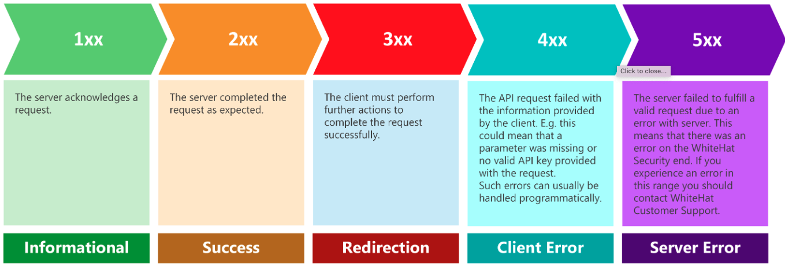

## API Queries

An API, or Application Programming Interface, is a way of accessing data directly from a website. In this way we can pull data from a website without having to deal with parsing HTML content. An API request occurs between a client and a server:

<figure markdown>
  
  <figcaption>Image by DATAQUEST</figcaption>
</figure>

Essentiall, we (the client) reach out to the server and request data. In return we get the data and a response code telling us how the request went. Sometimes we don't get the data and the response code can give us a hint as to why:


<figure markdown>
  
  <figcaption>Image by WhiteHat</figcaption>
</figure>

Each website (with an available API) should have more specific documentation on these codes and how to structure your request. Here we are going to cover how to use the STRINGDB API using Python and R. 

## API Request

=== "R"

    - We will first need to load the R packages necessary to handle API requests:
    
    ```
    library(httr)
    library(jsonlite)
    ```
    
    - Now we will need to take a look at the API documentation on the [STRINGDB website](https://string-db.org/help/api/). Typically, we have a base url that we pull from, and in this case is is:
    
    https://string-db.org/
    
    - We then need to plug in the information we would like to pull by adding to the url. So to get an image of the  information we will add the following to the url:
    
    ```
    api/json/interaction_partners?
    ```
    
    - To point to specific genes, say PTCH1, we will add the following:
    
    ```
    identifiers=PTCH1
    ```
    
    - Now the full url will be:
    
    ```
    https://string-db.org/api/json/interaction_partners?identifiers=PTCH1
    ```
    
    - We can now plug this url into the `GET` function!
    
    ```
    res <- GET("https://string-db.org/api/json/interaction_partners?identifiers=PTCH1")
    res
    ```
    
    !!! info "output"
        
        ```
        Response [https://string-db.org/api/json/interaction_partners?identifiers=PTCH1]
          Date: 2023-01-10 19:37
          Status: 200
          Content-Type: text/json; charset=utf-8
          Size: 2.72 kB
        ```
          
    - Here we see that our request did come through. However, the data is in json format. We can convert this json data to tabular data with:
    
    ```
    data = fromJSON(rawToChar(res$content))
    head(data)
    ```
    
    !!! info "output"
        
        ```
                   stringId_A           stringId_B preferredName_A preferredName_B
        1 9606.ENSP00000332353 9606.ENSP00000295731           PTCH1             IHH
        2 9606.ENSP00000332353 9606.ENSP00000297261           PTCH1             SHH
        3 9606.ENSP00000332353 9606.ENSP00000266991           PTCH1             DHH
        4 9606.ENSP00000332353 9606.ENSP00000256442           PTCH1           CCNB1
        5 9606.ENSP00000332353 9606.ENSP00000249373           PTCH1             SMO
        6 9606.ENSP00000332353 9606.ENSP00000376458           PTCH1            CDON
        ```
          
    
    - Congratulations! You have pulled data using an API!

=== "Python"


## References

1. https://www.dataquest.io/blog/r-api-tutorial/
2. https://www.dataquest.io/blog/python-api-tutorial/
3. https://apidocs.whitehatsec.com/whs/docs/error-handling
