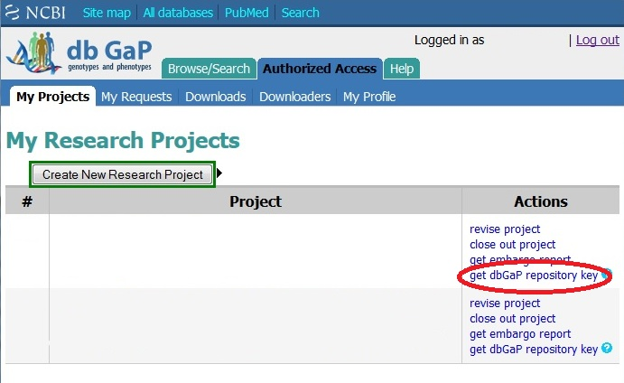
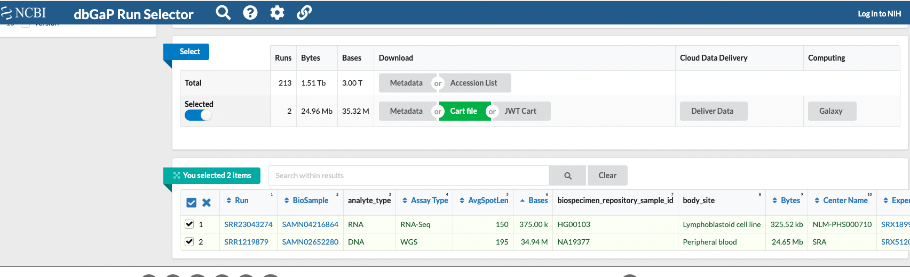

## Downloading Fastq Data Using dbGAP

dbGAP is a repository of data assessing the connection between genotypes and phenotypes. Here we discuss how to access this data using the Tufts HPC.

1. Obtain your dbGaP repository key by logging into dgGAP and clicking "get dbGAP repository key"

!!! info "[dbGAP Download Guide](https://www.ncbi.nlm.nih.gov/sra/docs/sra-dbgap-download/)"

    

2. Now, navigate to the [dbGAP SRA RUN Selector](https://www.ncbi.nlm.nih.gov/Traces/study/), login with your credentials, select the files you'd like to download, and click **Accession List**:



4. Upload this ngc file and the accession list to the desired directory on the Tufts HPC cluster. For more information on how to login to the cluster visit: [Navigate To The Cluster](../hpc-user-guide/navigate-to-cluster.md)

3. Now you will need to load the tools needed to download your data:

```bash
module load sra/2.10.8
```

4. Now you will need to configure the sratoolkit:

```bash
vdb-config --interactive
```
5. Hit "X"

6. Now set up the following batch script:

=== "Using Parallel"

    !!! info "dbGAP_download.sh"

        ```bash
        #!/bin/bash
        #SBATCH --job-name=dbGap
        #SBATCH --time=07-00:00:00
        #SBATCH --partition=largemem
        #SBATCH --nodes=1
        #SBATCH -c 8
        #SBATCH --mem=110Gb
        #SBATCH --output=%j.out
        #SBATCH --error=%j.err
        #SBATCH --mail-type=ALL
        #SBATCH --mail-user=Your.Email@tufts.edu
        
        module load sra/2.10.8 parallel
    
        # using parallel
        parallel --jobs 4 "fastq-dump -X 9999999999999 --ngc /path/to/projectNgcFile.ngc --split-files --gzip {}" < /path/to/accessionList.txt
        ```

=== "Not Using Parallel"

    !!! info "dbGAP_download.sh"

        ```bash
        #!/bin/bash
        #SBATCH --job-name=dbGap
        #SBATCH --time=07-00:00:00
        #SBATCH --partition=largemem
        #SBATCH --nodes=1
        #SBATCH -c 8
        #SBATCH --mem=110Gb
        #SBATCH --output=%j.out
        #SBATCH --error=%j.err
        #SBATCH --mail-type=ALL
        #SBATCH --mail-user=Your.Email@tufts.edu
    
        module load sra/2.10.8 
        
        # not using parallel
        fastq-dump -X 9999999999999 --ngc /path/to/projectNgcFile.ngc --gzip $(</path/to/accessionList.txt)
        ```
    
7. To run your script, enter the following:

```bash
sbatch dbGAP_download.sh
```

8. To check on the status of your job, enter the following:

```bash
squeue -u $USER
```

9. dbGAP repositories can contain a lot of data, so if you need your job extended reach out to [tts-research@tufts.edu](tts-research@tufts.edu)

## Downloading Other dbGAP Data

1. Obtain your dbGaP repository key by logging into dgGAP and clicking "get dbGAP repository key"

!!! info "[dbGAP Download Guide](https://www.ncbi.nlm.nih.gov/sra/docs/sra-dbgap-download/)"

    

2. Now, navigate to the [dbGAP SRA RUN Selector](https://www.ncbi.nlm.nih.gov/Traces/study/), login with your credentials, select the files you'd like to download, and click **Cart File**:


4. Upload this ngc file and the accession list to the desired directory on the Tufts HPC cluster. For more information on how to login to the cluster visit: [Navigate To The Cluster](../hpc-user-guide/navigate-to-cluster.md)

3. Now you will need to load the tools needed to download your data:

```bash
module load sra/2.10.8
```

4. Now you will need to configure the sratoolkit:

```bash
vdb-config --interactive
```
5. Hit "X"

6. Now set up the following batch script:

!!! info "dbGAP_download.sh"

        ```bash
        #!/bin/bash
        #SBATCH --job-name=dbGap
        #SBATCH --time=07-00:00:00
        #SBATCH --partition=largemem
        #SBATCH --nodes=1
        #SBATCH -c 8
        #SBATCH --mem=110Gb
        #SBATCH --output=%j.out
        #SBATCH --error=%j.err
        #SBATCH --mail-type=ALL
        #SBATCH --mail-user=Your.Email@tufts.edu
        
        module load sra/2.10.8
        prefetch -X 9999999999999 --ngc your_file.ngc cart_prj#####_###.krt
        vdb-decrypt --ngc your_file.ngc enc_file.xml
        ```

!!! note
    Note that we add in the option `-X 9999999999999`. This allows for files larger than 20GB, and without this option larger files will not download.

7. To run your script, enter the following:

```bash
sbatch dbGAP_download.sh
```

8. To check on the status of your job, enter the following:

```bash
squeue -u $USER
```

9. dbGAP repositories can contain a lot of data, so if you need your job extended reach out to [tts-research@tufts.edu](tts-research@tufts.edu)
## References

1. [dbGAP Download Guide](https://www.ncbi.nlm.nih.gov/sra/docs/sra-dbgap-download/)
