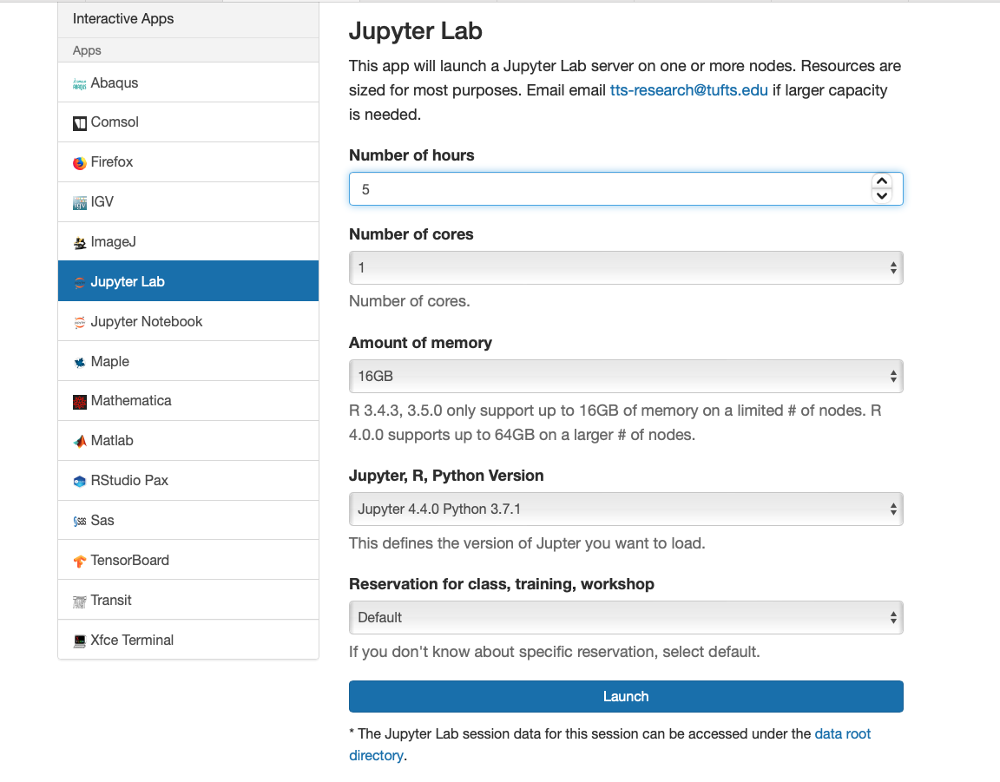

# JupyterLab

Often times you like to test your python code using an interactive development environment or IDE. We offer the python IDE, JupyterLab, to do just that. Here's how to request a Jupiter lab session OnDemand:

- Go to:

!!! info "[OnDemand](https://ondemand.pax.tufts.edu){:target="_blank" rel="noopener"}"

- Navigate to "Interactive Apps"
- Scroll down and click on "JupyterLab"
- Select:

    - how long of a session you would like
    - the number of cores, the memory
    - your python version
    - and your reservation

- Click "Launch" 
- Once your session is ready, click on the "Connect to JupyterLab"
