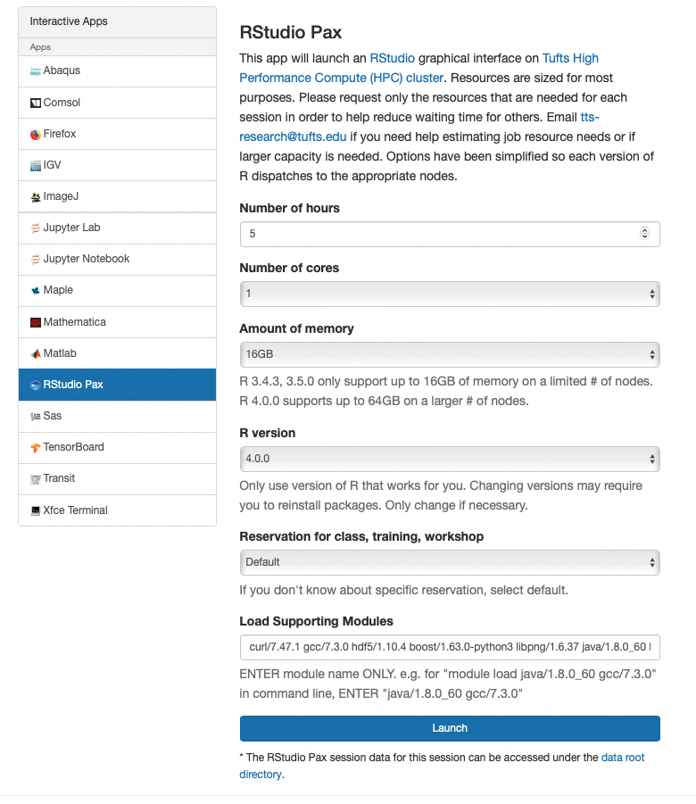

## RStudio Interactive App on OnDemand

- Login to the HPC cluster either by Command Line or the OnDemand Website. For information on how to log into the cluster check out:
    
!!! info "[Navigate To The Cluster](../hpc-user-guide/navigate-to-cluster.md){:target="_blank" rel="noopener"}"

- Go to "Interactive Apps" tab 
- Select "RStudio"
- Select the:

    - the time needed on the app
    - number of cores 
    - CPU memory you need
    - the version of R you wish to run. 
    - the modules needed for your pacakges to run 
        - typically the following are sufficient: 
        
        ```
        boost/1.63.0-python3 java/1.8.0_60 gsl/2.6
        ```
    
!!! note 

    - Each user can only start one OnDemand RStudio session on one compute node at a time. If you need to start multiple RStudio sessions, please make sure you select a different nodename from your current running session. 



- Click "Launch"
- Click on "Connect to RStudio"
- When you are finished:

    - exit RStudio properly `q()`
    - close the RStudio tab
    - Go back to the main OnDemand page 
    - Click "Delete" to end the session
