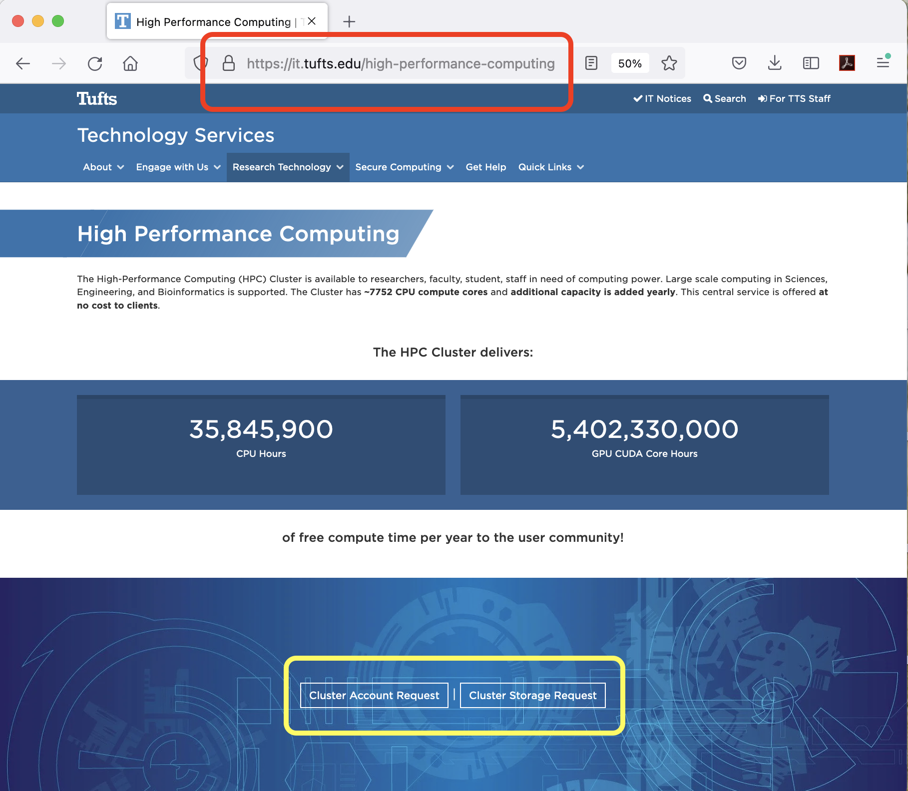

## HPC Storage

### Home Directory

- Your Home Directory (10GB, fixed) should be `/cluster/home/your_utln`

### Reserach Project Storage

- To Get Storage for a research project visit:

[:fontawesome-brands-google-play: Tufts Research Technology - High Performance Computing](https://it.tufts.edu/high-performance-computing){:target="_blank" rel="noopener" .md-button .md-button--primary}

-  Where you will see the following options:

- Your research projet storage (from 50GB and up) path should be `/cluster/tufts/yourlabname/`
- Each member of the lab group has a dedicated directory:

`/cluster/tufts/yourlabname/your_utln`

- To see your **research project storage quota** run the following command from **any node on the new cluster Pax**:

`df -h /cluster/tufts/yourlabname ` 

!!! note

    Accessing your research project storage space for the __first time__, please make sure you type out the __FULL PATH__ to the directory.

- If your group has existing HPC research project storage space set up, please use the same link to request access. 

